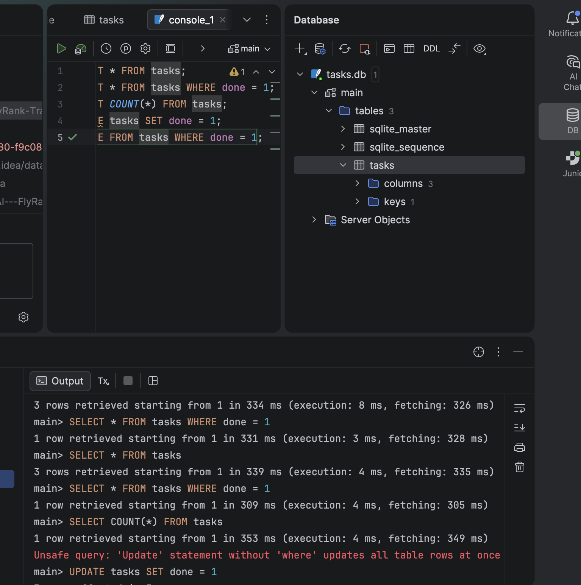

# To-Do List Task Management API

A simple RESTful CRUD API for managing to-do list tasks built using **Python**, **FastAPI**, and **Pydantic**.

## How to Run the Project

1. **Clone the repository:**
   ```bash
   git clone <your-repository-url>
   cd <your-repository-folder>
   ```

2. **Create and activate a virtual environment:**
   ```bash
   python -m venv venv
   # On Windows:
   venv\Scripts\activate
   # On macOS/Linux:
   source venv/bin/activate
   ```

3. **Install dependencies:**
   ```bash
   pip install fastapi uvicorn pydantic
   ```

4. **Start the server:**
   ```bash
   uvicorn main:app --reload
   ```
   > **Note:** Running the app automatically creates the SQLite database file (`tasks.db`) and initializes the `tasks` table if it does not already exist.

5. **Access Interactive API Docs:**
   Open your browser to `http://127.0.0.1:8000/docs` to test endpoints via Swagger UI.

**API endpoints**

| Method | Endpoint     |
|--------|--------------|
| GET    | /tasks       |
| POST   | /tasks       |
| GET    | /tasks/{id}  |
| PATCH  | /tasks/{id}  |
| GET    | /tasksStatus |
| DELETE | /tasks/{id}  |

**pasted curl -i request**

(.venv) shimaas-MacBook-Air:Backend-AI---FlyRank-Training shimaakamal$ 
curl -i -X PUT http://127.0.0.1:8000/tasks/1 
>   -H "Content-Type: application/json" \
>   -d '{"title": "Buy organic groceries", "done": true}'
HTTP/1.1 200 OK
date: Thu, 10 Sep 2026 15:11:00 GMT
server: uvicorn
content-length: 52
content-type: application/json

{"id":1,"title":"Buy organic groceries","done":true}

**SWAGGER UI:**


## Database Choice & Storage

* **Why SQLite?** 
  it is serverless, zero-configuration, and stores data in a single file.

* **Database Storage:**
  The database file (`tasks.db`) is generated programmatically in the root directory of the project when the application initializes.

* **Database Viewer:**
