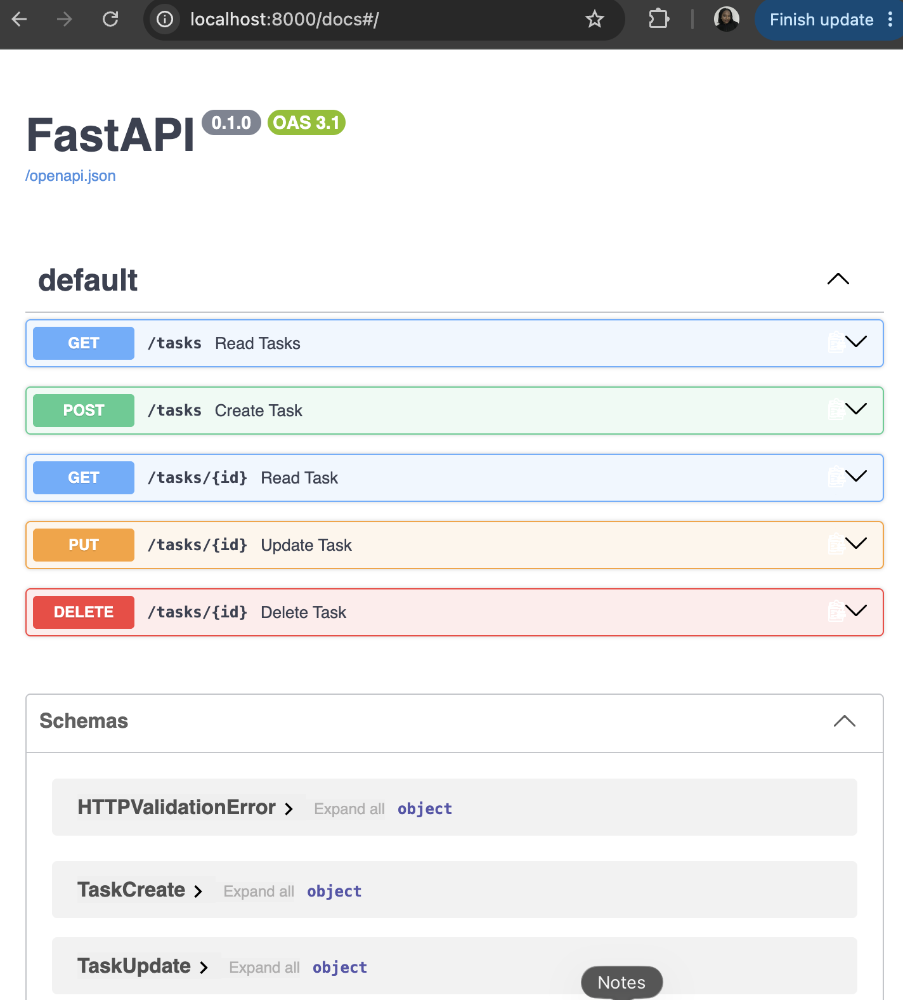

# To-Do List Task Management API

A simple RESTful CRUD API for managing to-do list tasks built using **Python**, **FastAPI**, and **Pydantic**.

**How to install and run:**

1. Activate virtual environment by : source .venv/bin/activate
2. install dependencies: pip install fastapi uvicorn pydantic
3. start the server 
- for health status and root endpoint: uvicorn main:app --reload 
- for all CRUD operations : uvicorn Task:app --reload 
4. Access Swagger UI by :http://127.0.0.1:8000/docs

**API endpoints**

| Method | Endpoint    |
|--------|-------------|
| GET    | /tasks      |
| POST   | /tasks      |
| GET    | /tasks/{id} |
| PUT    | /tasks/{id} |
| DELETE | /tasks/{id} |

**pasted curl -i request**

(.venv) shimaas-MacBook-Air:Backend-AI---FlyRank-Training shimaakamal$ 
curl -i -X PUT http://127.0.0.1:8000/tasks/1 
>   -H "Content-Type: application/json" \
>   -d '{"title": "Buy organic groceries", "done": true}'
HTTP/1.1 200 OK
date: Thu, 10 Sep 2026 15:11:00 GMT
server: uvicorn
content-length: 52
content-type: application/json

{"id":1,"title":"Buy organic groceries","done":true}

**SWAGGER UI:**

